# VideogamesShop
Videogames shop is a fictional website where you can buy different videogames.
This is the first look of the website: 
## Home page
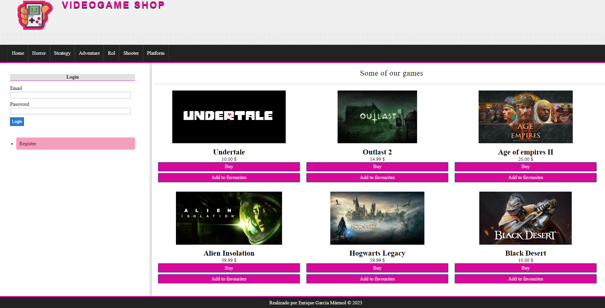

## User View

On the left of the web page we can either login, or register.
### Register
In the register form we introduce our info, of course there are some checks in the backend so that the email doesnt exists, the name isn't numeric...
Optionally we can add a profile photo.

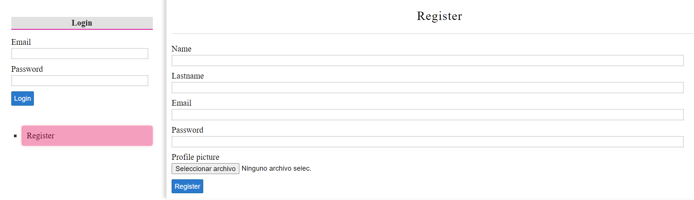

### Login
After succesfully registering we login with that user:
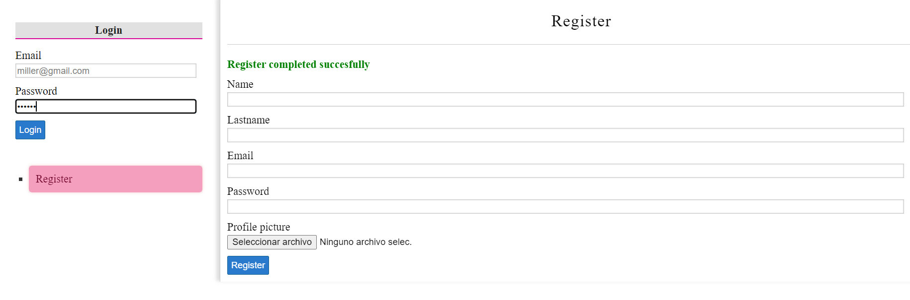

Now that we are logged we can buy any game that is in the web. Further more we can clasify by categories:
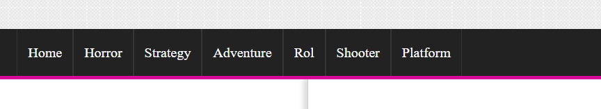

## SIDEBAR: 
Now lets take a look at the sidebar. 
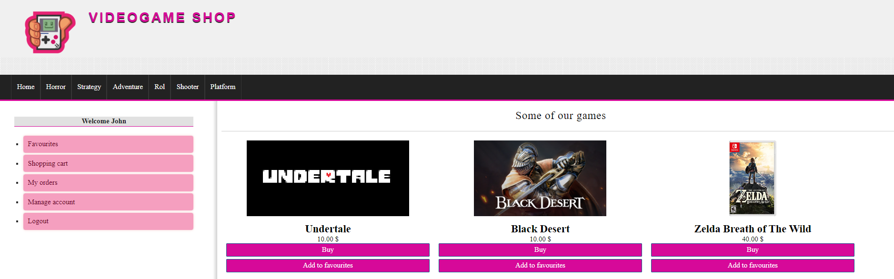
### Favourite Games
Here we have our favourite games that we have been choosing
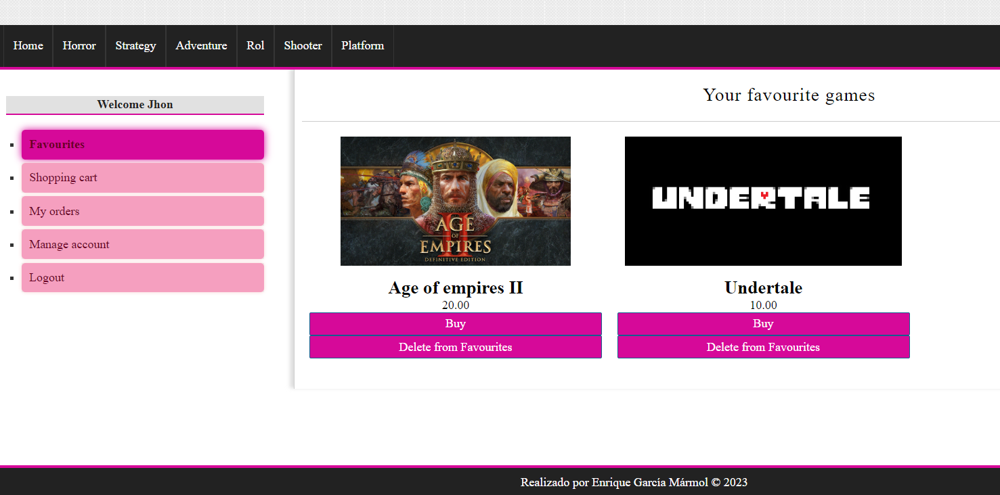
And if you want to delete a game from favourites just press the botton delete from favourites.
### Shopping cart
Then there's the shopping cart:
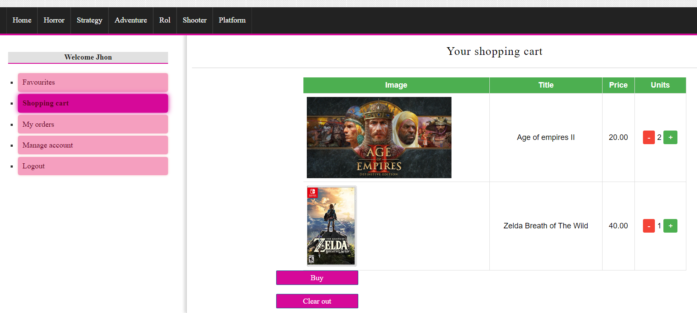
Where we can add different games to it, and buy them.
We add some shippment information: 
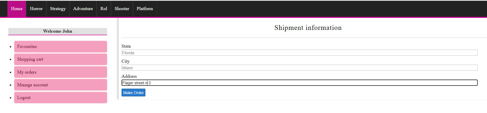
And if everything is correct your order is ordered succesfully
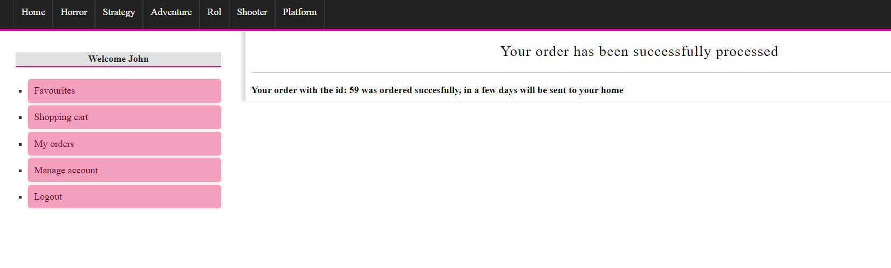
### Orders
Coming back to the sidebar we can see our current orders : 
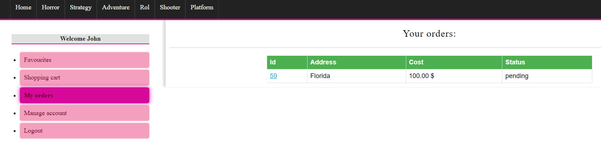
And if you click in the order you can see all the information:
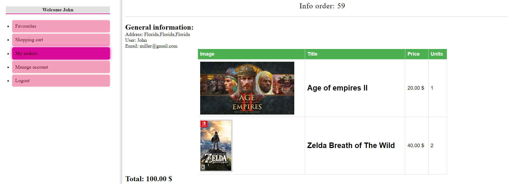
### Manage account

Of course we have the option of managing your account, just in case you want to change something:
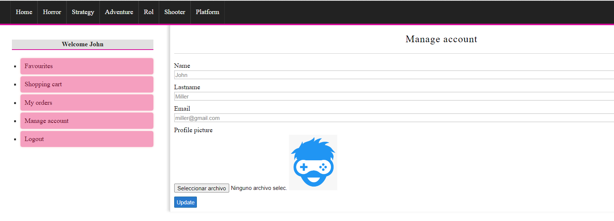
### Logout
And finally we have the option for logout.

## Admin view
If the user has admin permissions will be able to manage the categories and manage the products

## Manage categories

Here we have listed all the categories, with a button for creating a new one 

We create one 

And now the category is created and listed not only in the table,, but in the main menu as well
