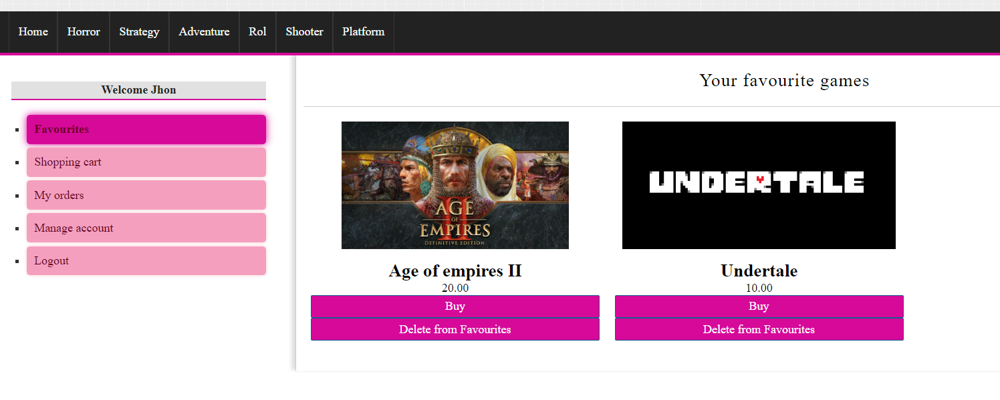

# VideogamesShop
Videogames shop is a fictional website, where you can buy different videogames.
This is the first look of the website: 

On the left of the web page we can either login, or register.
In the register form we introduce our info, of course there are some checks in the backend so that the email doesnt exists, the name isn't numeric...
Optionally we can add a profile photo.

After succesfully registering we login with that user:

Now that we are logged we can buy any game that is in the web. Further more we can clasify by categories:

## SIDEBAR: 
Now lets take a look at the sidebar. 

Here we have our favourite games that we have been choosing

And if you want to delete a game from favourites just press the botton delete from favourites.
Then there's the shopping cart:

Where we can add different games to it, and buy them.
We add some shippment information: 

And if everything is correct your order is ordered succesfully

Coming back to the sidebar we can see our current orders : 

And if you click in the order you can see all the information:

Of course we have the option of managing your account, just in case you want to change something:

And finally we have the option for logout.
This is the user View, in a few days i will explain what the admin can do
